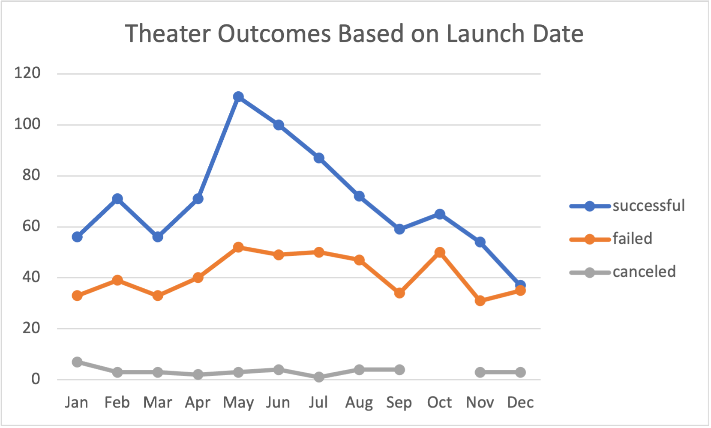
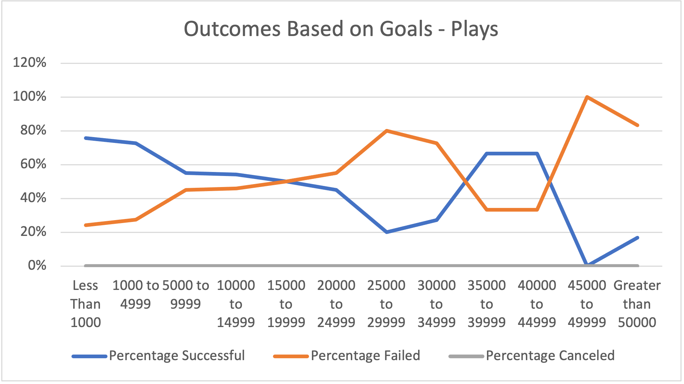
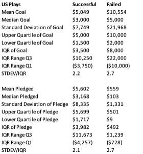

# Kickstarting with Excel
Author: Bob Ciminera

## Project Overview

Louise is an “up and coming” playwright who plans to launch a crowdfunding campaign to fund her new play "Fever". She estimates a budget of $10,000 and as this is her first fund raising campaign has asked for assistance to understand what is required for a successful outcome. 

### Purpose

The purpose of this analysis is to use Excel to help Louise understand the specific factors that make a project campaign successful.  This will help her mirror those factors to set up her project.

The resulting data for the analysis is in the following workbook:

[Kickstarter_Challenge.xlsx](Kickstarter_Challenge.xlsx)

## Analysis and Challenges

### Analysis of Outcomes Based on Launch Date

In order to complete the analysis of Outcomes Based on Launch Date to Convert Unix timestamps to Human Dates with Month, Date, and Year to set up the analysis to determine whether timing was a factor in successful fund raising campaigns.

A pivot table and pivot chart were created to depict the Successful, Failed, and Canceled campaigns by month of the year.  Live campaigns were filtered out and the pivot table was sorted in ascending order by month to create the line chart below. 

This analysis shows both the number of campaigns as well as the success rate. 

 

### Analysis of Outcomes Based on Goals

In order to complete the analysis of Outcomes Based on Goals a table was created with 12 ranges of $ Pledged by Goal.

The COUNTIFS() function was used to group the ranges into Successful, Failed, and Canceled outcomes for the "plays" subcategory and a percentage outcome was calculated for each range.

The chart below was created to visualize the outcomes by Goal $ Segment.  This was useful to determine whether $ value of Goals have an impact on outcome.

 

### Challenges and Difficulties Encountered

The biggest challenge in this analysis was the inability to get to more specific actions to guide Louise in her campaign other than when to launch. With only a exceptions, dollar size of goal or pledge did not predict rate of success.

In addition, the data indicates that there are some failed kickstarters with really high goals.  Each outcome subset of Goals and Pledges has a similar distribution given the proximity of the Mean and Median values in each case. However, the fact that the STDDEV/IQR for Failed projects is high would suggest that there are some Failed programs that had extremely high goals.  

 

## Results

### Conclusions about Theater Outcomes by Launch Date
1. The month of May has the highest overall Launch outcome successes.
2. The months of May, June, and July have the highest success rates. 

### Conclusions about Outcomes based on Goals
1. In general the higher the goal the higher the failure rate.  However, even if Louise lowered her goal for "Fever" to less than $10,000 the probability of success remains in the 50% range based on the historical data.  

### What are some limitations of this dataset?

There are clearly other factors then Goal amount and month of the year that influence whether a project is successfully funded.  Other factors need to be included in the data set so that future funders can use the information to increase their probability of success.  

### What are some other possible tables and/or graphs that we could create?

Box Plot of Successfully Funded Plays in the US

Proposal Quality: Data that indicates quality of the proposal in terms of some required content, length, and other factors that are deemed important to potential investors.

Demographics of Campaign: Data that shows how the campaign was distributed, who it was exposed to, and who actually “read” the proposal

